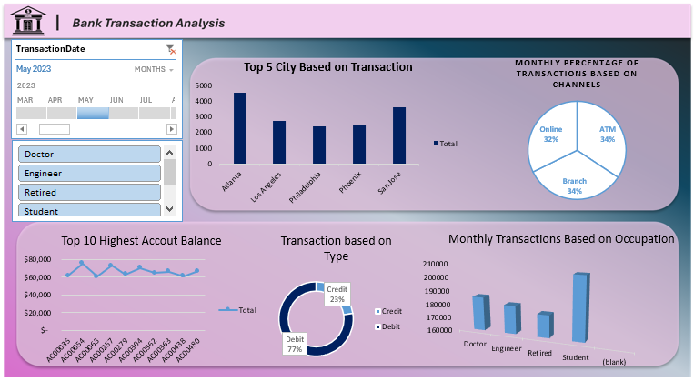

## Data Analytics Portfolio
**Project 1**

**Title:** [Bank Transaction Interactive Dashboard](https://github.com/Davunch/lesinwadave.github.io/blob/main/bank_transactions_Dashboard.xlsx)

**Tools Used:** Microsoft Excel(Pivot Table,Pivot Chart,Timeline and Slicers) 

**Project Description:**  This project involved analysing transaction data of a bank to identify trends and patterns in various transactions for 2020. It is designed to provide a comprehensive overview of key
performance metrics. This dashboard allows stakeholders to easily monitor and analyze the Bank’s performance across different locations and time periods. The dashboard includes the following features:
Top 5 Cities Based on Transactions: Visual representation of transaction broken down by each location. Monthly Percentage of Transactions by Channels: A monthly breakdown of the total transaction carried out through Atm,Online and Branch, providing insights into performance of the various
channels over time. Top 10 Highest Account Balances: Displays the top 10 accounts with highest, allowing for easy comparison of account balance throughout the year. Transaction Breakdown by Type: Highlights the total transactions carried out via various type,
showcasing the credit or debit transactions in different locations. Additionally, the dashboard includes interactive slicer and timeline for: Month: Filter the data to view performance for a specific month or range of months.
Occupation: Focus on specific occupations to analyze location performance.

**Key findings:** Transaction Trends by City 
Atlanta leads in transaction volume among the top 5 cities, followed by San Jose.These cities are high-priority regions for banking services, indicating strong customer engagement or dense population centers.
Transaction Channels Distribution: Transactions are evenly distributed across Online (32%), ATM (34%), and Branch (34%). The equal distribution highlights a balance in customer preference for digital and physical 
banking channels. It indicates the need for maintaining robust infrastructure in all three channels. Top 10 Account Balances:
The highest account balances are concentrated in a small group of accounts, suggesting a few premium customers who hold significant financial resources.These accounts represent high-value customers who might
benefit from tailored services and relationship management. Transaction Types: Debit transactions (77%) dominate over credit transactions (23%). This indicates higher outgoing financial activity, which could 
point to consumer spending trends or bill payments. Monthly Transactions by Occupation: Students account for the highest transaction volume compared to other occupations (Doctors, Engineers, Retired individuals).
This could suggest younger demographics are more active in day-to-day banking or financial transactions. Targeted campaigns for student banking products might be beneficial.

**Dashboard Overview:**

# Project 2

**Title:** Pizza Data Interrogation

**SQL Code:** [Pizza Sql Queries](https://github.com/Davunch/lesinwadave.github.io/blob/main/Pizza.Sql)

**SQL Skills Used:**
Data Retrieval (SELECT): Queried and extracted specific information from the database.

Data Aggregation (SUM, COUNT): Calculated totals, such as sales and quantities, and counted records to analyze data trends.

Data Filtering (WHERE, BETWEEN, IN, AND): Applied filters to select relevant data, including filtering by ranges and lists.

Data Source Specification (FROM): Specified the tables used as data sources for retrieval

**Project Description:**
Total Revenue Calculation: Query to calculate the total revenue generated from all pizza sales.

Total Pizzas Sold: Determine the total number of pizzas sold by summing up the quantity column.

Total Number of Orders: Count the total number of unique orders in the dataset using the order_id column.

Sales of Veggie Pizza Category: Calculate the total quantity of pizzas sold in the Veggie category.

Sales of Specific Pizza Types: Retrieve details of orders involving "The Hawaiian Pizza" and "The Greek Pizza."

Pizzas Ordered in January 2015: List all pizzas ordered during January 2015.

Orders Between November and December 2015: Fetch orders placed between November 1, 2015, and December 31, 2015.

Spinach Supreme Pizza Sales in March 2015: Calculate the total quantity of "The Spinach Supreme Pizza" sold during March 2015.

Medium-Sized Pizza Sales: Retrieve a list of all medium-sized pizzas sold (pizza_size = 'm').

Pizzas Sold for More Than $12.5: List pizzas sold with a unit price greater than or equal to $12.5.

**Technology used:** SQL server

# Project 3

**Title:** Global Super Store Interactive Dashboard

**Tools Used:** Power Bi(Card,Map,Pie chart,stacked column chart and stacked bar chart)

**Project Description:**
Cards: These high-level metrics provide an immediate snapshot of the company's overall performance. Overview Metrics from Total Sales showed $12.64M,Total Profit was $1.47M,Total Quantity Sold was 178K
and Average Delivery Days was 8 days.

Sales Breakdown by State: Top-performing states such as England, New South Wales, and New York show significant sales contributions.
Highlights opportunities for improving sales in underperforming regions like Wyoming and Manitoba.

Top 5 Regions by Sales: Western Europe leads with $1.7M in sales, followed by Central America ($1.2M) and Oceania ($1M).
Identifies regional strengths and growth potential.

Profit by State (Geographical Map): A geographical heatmap showing profit distribution, highlighting regions with high and low profitability for targeted improvement.

**Key findings:**

**Dashboard Overview:**
